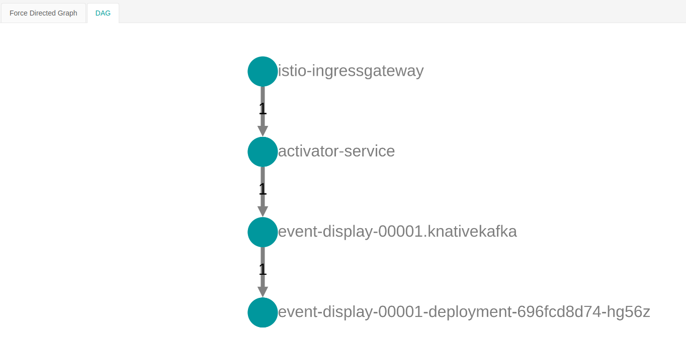

# knative exploration


## Install k3s on top of firecracker VMs via weaveworks ignite
- Create master VM  
```
$ sudo ignite run --config master.yml
INFO[0001] Created VM with ID "67b46cc4bc3fd496" and name "master" 
INFO[0001] Networking is handled by "cni"               
INFO[0001] Started Firecracker VM "67b46cc4bc3fd496" in a container with ID "ignite-67b46cc4bc3fd496" 
$ 
```
- Attach to the newly created firecracker master VM and install k3s without traefik
```
$ sudo ignite attach master

...

CentOS Linux 7 (Core)
Kernel 4.19.125 on an x86_64

67b46cc4bc3fd496 login: root
Password: 
[root@67b46cc4bc3fd496 ~]# yum install -y which curl

...

Dependency Updated:
  libcurl.x86_64 0:7.29.0-59.el7_9.1                                            

Complete!
[root@67b46cc4bc3fd496 ~]# export INSTALL_K3S_SKIP_START=true
[root@67b46cc4bc3fd496 ~]# curl -sfL https://get.k3s.io | sh -

...

[INFO]  systemd: Enabling k3s unit
Created symlink from /etc/systemd/system/multi-user.target.wants/k3s.service to /etc/systemd/system/k3s.service.
[root@67b46cc4bc3fd496 ~]# 
[root@67b46cc4bc3fd496 ~]# nohup k3s server --disable traefik &

...

root@67b46cc4bc3fd496 ~]# kubectl get nodes
NAME               STATUS   ROLES                  AGE   VERSION
67b46cc4bc3fd496   Ready    control-plane,master   42s   v1.20.0+k3s2
[root@67b46cc4bc3fd496 ~]# 

```
- grab kubeconfig from /etc/rancher/k3s/k3s.yaml and store it in your local workstation, and modify it to use the public IP address of the master VM (use 'ifconfig eth0' in the master VM to get it)
```
$ alias | grep kubectl
alias k='kubectl --kubeconfig ~/k3s-kubeconfig.yaml'
$ cat ~/k3s-kubeconfig.yaml | grep 6443
    server: https://10.61.0.14:6443
$ k get nodes
NAME               STATUS   ROLES                  AGE   VERSION
67b46cc4bc3fd496   Ready    control-plane,master   11m   v1.20.0+k3s2
$ 
```
- note: if k3s cluster was installed with traefik ingress controller installed, remove it with the following commands
```
$ kubectl delete -n kube-system helmcharts traefik
$ sudo rm /var/lib/rancher/k3s/server/manifests/traefik.yaml

```
- create the second VM, node1 as a worker node, install k3s binaries
```
$ sudo ignite run --config node1.yml
$ sudo ignite attach node1
[ in node1]
# yum install -y curl which
# export INSTALL_K3S_SKIP_START=true
# curl -sfL https://get.k3s.io | sh -
```
- grab the k3s token from /var/lib/rancher/k3s/server/node-token on the master VM and set as a variable on node1
```
# export TOKEN=<insert_token_from_master>
# nohup k3s agent --server https://10.61.0.14:6443 --token $TOKEN &
```
- Wait for a little bit, then validate that node1 is also available as a k3s worker node
```
$ k get nodes
NAME               STATUS   ROLES                  AGE   VERSION
67b46cc4bc3fd496   Ready    control-plane,master   23m   v1.20.0+k3s2
657d65c45823af58   Ready    <none>                 56s   v1.20.0+k3s2
$ k get po --all-namespaces
NAMESPACE     NAME                                      READY   STATUS    RESTARTS   AGE
kube-system   metrics-server-86cbb8457f-jv9z4           1/1     Running   0          23m
kube-system   coredns-854c77959c-xr4b8                  1/1     Running   0          23m
kube-system   local-path-provisioner-7c458769fb-xw8hz   1/1     Running   0          23m
$ 
```

## Install istio on top of k3s cluster

```
$ istioctl install --set profile=demo
his will install the Istio demo profile with ["Istio core" "Istiod" "Ingress gateways" "Egress gateways"] components into the cluster. Proceed? (y/N) Y
✔ Istio core installed                                     
- Processing resources for Istiod. Waiting for Deployment/istio-system/istiod                         
✔ Istiod installed 
✔ Egress gateways installed            
✔ Ingress gateways installed    
✔ Installation complete
$
$ k get po -n istio-system
NAME                                   READY   STATUS    RESTARTS   AGE
istiod-575d4664c5-pzvk2                1/1     Running   0          4m28s
svclb-istio-ingressgateway-vgjsv       5/5     Running   0          4m10s
svclb-istio-ingressgateway-tr8mf       5/5     Running   0          4m10s
istio-egressgateway-6b777b7484-bv5mx   1/1     Running   0          4m10s
istio-ingressgateway-9b86859b9-2s6jc   1/1     Running   0          4m10s
$ 

```
- Install kiali, prometheus and jaeger add-ons
```
$ k apply -f ../istio-1.8.1/samples/addons/prometheus.yaml 
$ k apply -f ../istio-1.8.1/samples/addons/jaeger.yaml
$ k apply -f ../istio-1.8.1/samples/addons/kiali.yaml 
$ k config set-context --current --namespace=istio-system
Context "default" modified.
$ k get po
NAME                                   READY   STATUS    RESTARTS   AGE
istiod-575d4664c5-pzvk2                1/1     Running   0          10m
svclb-istio-ingressgateway-vgjsv       5/5     Running   0          10m
svclb-istio-ingressgateway-tr8mf       5/5     Running   0          10m
istio-egressgateway-6b777b7484-bv5mx   1/1     Running   0          10m
istio-ingressgateway-9b86859b9-2s6jc   1/1     Running   0          10m
prometheus-7bfddb8dbf-n86bf            2/2     Running   0          2m27s
jaeger-7f78b6fb65-rc8m9                1/1     Running   0          99s
kiali-7476977cf9-xr227                 1/1     Running   0          68s
$ 
```
- Modify kiali service definition to LoadBalancer
```
$ k edit svc kiali
service/kiali edited
$ 
$ k get svc kiali
NAME    TYPE           CLUSTER-IP      EXTERNAL-IP   PORT(S)                          AGE
kiali   LoadBalancer   10.43.171.192   10.61.0.14    20001:31974/TCP,9090:32293/TCP   3m16s
$ 
```
- now kiali UI can be accessed using the external IP address at port 20001 (e.g. http://10.61.0.14:20001)
- Validate that istio is working properly by installing the sample hello & world service
```
$ k create ns world
namespace/world created
$ k label namespace world istio-injection=enabled
namespace/world labeled
$ k apply -f world.yml -n world
deployment.apps/world-v1 created
service/world-v1 created
deployment.apps/world-v2 created
service/world-v2 created
service/world created
$ k get po -n world
NAME                        READY   STATUS    RESTARTS   AGE
world-v2-96f7f4578-k66jz    2/2     Running   0          22s
world-v1-57f964597f-mjfxz   2/2     Running   0          22s
$ 
$ k create ns hello
namespace/hello created
$ k label namespace hello istio-injection=enabled
namespace/hello labeled
$ k apply -f hello.yml -n hello
deployment.apps/hello created
service/hello created
$ k apply -f hello_ingress.yml -n hello
Warning: extensions/v1beta1 Ingress is deprecated in v1.14+, unavailable in v1.22+; use networking.k8s.io/v1 Ingress
ingress.extensions/hello created
$ k get po -n hello
NAME                     READY   STATUS    RESTARTS   AGE
hello-79475c85b5-wdfs6   2/2     Running   0          23s
hello-79475c85b5-bttlh   2/2     Running   0          23s
$ k get ing -n hello
NAME    CLASS    HOSTS   ADDRESS   PORTS   AGE
hello   <none>   *                 80      18s
$ 
$ k get svc istio-ingressgateway
NAME                   TYPE           CLUSTER-IP   EXTERNAL-IP   PORT(S)                                                                      AGE
istio-ingressgateway   LoadBalancer   10.43.10.0   10.61.0.14    15021:31872/TCP,80:31517/TCP,443:30288/TCP,31400:32764/TCP,15443:32607/TCP   21m
$ 
$ curl http://10.61.0.14/hello
hello (10.42.0.11) earth (10.42.1.9)!!$ 
$ 
```
- Validate that the interaction can be visualized in kiali


- You can also change jaeger tracing service to LoadBalancer and view the interaction (also change the port not to use port 80 since that conflicts with istio-ingressgateway)
```
$ k edit svc tracing
service/tracing edited
$ k get svc tracing
NAME      TYPE           CLUSTER-IP      EXTERNAL-IP   PORT(S)           AGE
tracing   LoadBalancer   10.43.163.189   10.61.0.15    16686:30005/TCP   19m
$ 
```


## install knative-serving on top of istio

```
$ k apply --filename https://github.com/knative/serving/releases/download/v0.19.0/serving-crds.yaml

$ k apply --filename https://github.com/knative/serving/releases/download/v0.19.0/serving-core.yaml

$ k config set-context --current --namespace=knative-serving
Context "default" modified.
$ k get po
NAME                          READY   STATUS    RESTARTS   AGE
autoscaler-696d8868f4-s2jtj   1/1     Running   0          2m3s
controller-7f7566fbcb-vc2sz   1/1     Running   0          2m3s
webhook-54d6f984b4-h6h8q      1/1     Running   0          2m3s
activator-845748699b-xqwpt    1/1     Running   0          2m3s
$ 

$ k apply --filename https://github.com/knative/net-istio/releases/download/v0.19.0/release.yaml
$
$ k get po
NAME                                READY   STATUS    RESTARTS   AGE
autoscaler-696d8868f4-s2jtj         1/1     Running   0          3m33s
controller-7f7566fbcb-vc2sz         1/1     Running   0          3m33s
webhook-54d6f984b4-h6h8q            1/1     Running   0          3m33s
activator-845748699b-xqwpt          1/1     Running   0          3m33s
istio-webhook-7dd7c94c7b-zlnbq      1/1     Running   0          31s
networking-istio-85f6b5c894-nv549   1/1     Running   0          31s
$ 

$ k apply --filename https://github.com/knative/serving/releases/download/v0.19.0/serving-default-domain.yaml
```
- validate the installation of knative serving using monkey.yaml
```
$ cat monkey.yml 
apiVersion: serving.knative.dev/v1
kind: Service
metadata:
  name: monkey
  namespace: default
spec:
  template:
    metadata:
      name: monkey-version-1
    spec:
      containers:
        - image: awiradarma/greeting:1.0
          env:
            - name: GREETING_MESSAGE
              value: "Monkey v1"
            - name: QUARKUS_HTTP_PORT
              value: "7778"
          ports:
            - name: http1
              containerPort: 7778
  traffic:
  - tag: current
    revisionName: monkey-version-1
    percent: 100
  - tag: latest
    latestRevision: true
    percent: 0
$ k label namespace default istio-injection=enabled
namespace/default labeled
$ k apply -f monkey.yml 
service.serving.knative.dev/monkey created
$ k config set-context --current --namespace=default
Context "default" modified.
$ k get ksvc
NAME     URL                                       LATESTCREATED      LATESTREADY   READY     REASON
monkey   http://monkey.default.10.61.0.14.xip.io   monkey-version-1                 Unknown   RevisionMissing
$ 
$ curl http://monkey.default.10.61.0.14.xip.io/greeting
Monkey v1 ( monkey-version-1-deployment-6dfcff9bf-pswhz/10.42.1.15 ) $ 
$ k get ksvc
NAME     URL                                       LATESTCREATED      LATESTREADY        READY   REASON
monkey   http://monkey.default.10.61.0.14.xip.io   monkey-version-1   monkey-version-1   True    
$ k get po
NAME                                          READY   STATUS        RESTARTS   AGE
monkey-version-1-deployment-6dfcff9bf-pswhz   3/3     Running       0          12s
monkey-version-1-deployment-6dfcff9bf-hzxvf   2/3     Terminating   0          111s
$ 
```
- The interaction can be seen from jaeger as well as from kiali


## knative eventing
- note: if you ever need to delete knative-eventing namespace and reinstall again, make sure to delete the two knative-eventing validating webhook first
```
$ k delete ValidatingWebhookConfiguration config.webhook.eventing.knative.dev
validatingwebhookconfiguration.admissionregistration.k8s.io "config.webhook.eventing.knative.dev" deleted
$ k delete ValidatingWebhookConfiguration validation.webhook.eventing.knative.dev
validatingwebhookconfiguration.admissionregistration.k8s.io "validation.webhook.eventing.knative.dev" deleted
$ 
```
- Install CRDs, core components and the default in-memory channel and broker
```
$ k apply --filename https://github.com/knative/eventing/releases/download/v0.19.0/eventing-crds.yaml
$ k apply --filename https://github.com/knative/eventing/releases/download/v0.19.0/eventing-core.yaml
$ k apply --filename https://github.com/knative/eventing/releases/download/v0.19.0/in-memory-channel.yaml
$ k apply --filename https://github.com/knative/eventing/releases/download/v0.19.0/mt-channel-broker.yaml
$ k config set-context --current --namespace=knative-eventing
Context "default" modified.
$ k get po
NAME                                    READY   STATUS    RESTARTS   AGE
eventing-controller-66c877b879-qtbcj    1/1     Running   0          60s
eventing-webhook-644c5c7667-sshrs       1/1     Running   0          60s
imc-controller-587f98f97d-4kstm         1/1     Running   0          43s
imc-dispatcher-6db95d7857-vghzx         1/1     Running   0          43s
mt-broker-ingress-7d8595d747-8q2dx      1/1     Running   0          31s
mt-broker-filter-6bd64f8c65-bt4pc       1/1     Running   0          32s
mt-broker-controller-76b65f7c96-rbbsv   1/1     Running   0          31s
$ 

```
- At this point, you can follow the instructions at https://knative.dev/docs/eventing/getting-started/ : 
```
$ k create ns event-example
namespace/event-example created
$ kubectl create -f - <<EOF
apiVersion: eventing.knative.dev/v1
kind: broker
metadata:
 name: default
 namespace: event-example
EOF
broker.eventing.knative.dev/default created
$ 
$ kubectl -n event-example get broker default
NAME      URL                                                                              AGE   READY   REASON
default   http://broker-ingress.knative-eventing.svc.cluster.local/event-example/default   41s   True    
$ 
$ kubectl -n event-example apply -f - << EOF
apiVersion: apps/v1
kind: Deployment
metadata:
  name: hello-display
spec:
  replicas: 1
  selector:
    matchLabels: &labels
      app: hello-display
  template:
    metadata:
      labels: *labels
    spec:
      containers:
        - name: event-display
          image: gcr.io/knative-releases/knative.dev/eventing-contrib/cmd/event_display

---

kind: Service
apiVersion: v1
metadata:
  name: hello-display
spec:
  selector:
    app: hello-display
  ports:
  - protocol: TCP
    port: 80
    targetPort: 8080
EOF

$ kubectl -n event-example apply -f - << EOF
apiVersion: apps/v1
kind: Deployment
metadata:
  name: goodbye-display
spec:
  replicas: 1
  selector:
    matchLabels: &labels
      app: goodbye-display
  template:
    metadata:
      labels: *labels
    spec:
      containers:
        - name: event-display
          # Source code: https://github.com/knative/eventing-contrib/tree/master/cmd/event_display
          image: gcr.io/knative-releases/knative.dev/eventing-contrib/cmd/event_display

---

kind: Service
apiVersion: v1
metadata:
  name: goodbye-display
spec:
  selector:
    app: goodbye-display
  ports:
  - protocol: TCP
    port: 80
    targetPort: 8080
EOF

$ kubectl -n event-example get deployments hello-display goodbye-display
NAME              READY   UP-TO-DATE   AVAILABLE   AGE
hello-display     1/1     1            1           58s
goodbye-display   1/1     1            1           29s
$ 

$ kubectl -n event-example apply -f - << EOF
apiVersion: eventing.knative.dev/v1
kind: Trigger
metadata:
  name: hello-display
spec:
  broker: default
  filter:
    attributes:
      type: greeting
  subscriber:
    ref:
     apiVersion: v1
     kind: Service
     name: hello-display
EOF

$ kubectl -n event-example apply -f - << EOF
apiVersion: eventing.knative.dev/v1
kind: Trigger
metadata:
  name: goodbye-display
spec:
  broker: default
  filter:
    attributes:
      source: sendoff
  subscriber:
    ref:
     apiVersion: v1
     kind: Service
     name: goodbye-display
EOF

$ kubectl -n event-example get triggers
NAME              BROKER    SUBSCRIBER_URI                                            AGE   READY   REASON
hello-display     default   http://hello-display.event-example.svc.cluster.local/     42s   True    
goodbye-display   default   http://goodbye-display.event-example.svc.cluster.local/   19s   True    
$ 

$ kubectl -n event-example apply -f - << EOF
apiVersion: v1
kind: Pod
metadata:
  labels:
    run: curl
  name: curl
spec:
  containers:
    # This could be any image that we can SSH into and has curl.
  - image: radial/busyboxplus:curl
    imagePullPolicy: IfNotPresent
    name: curl
    resources: {}
    stdin: true
    terminationMessagePath: /dev/termination-log
    terminationMessagePolicy: File
    tty: true
EOF

$ kubectl -n event-example attach curl -it
Defaulting container name to curl.
Use 'kubectl describe pod/curl -n event-example' to see all of the containers in this pod.
If you don't see a command prompt, try pressing enter.
[ root@curl:/ ]$ curl -v "http://broker-ingress.knative-eventing.svc.cluster.local/event-example/default" \
>   -X POST \
>   -H "Ce-Id: say-hello" \
>   -H "Ce-Specversion: 1.0" \
>   -H "Ce-Type: greeting" \
>   -H "Ce-Source: not-sendoff" \
>   -H "Content-Type: application/json" \
>   -d '{"msg":"Hello Knative!"}'
> POST /event-example/default HTTP/1.1
> User-Agent: curl/7.35.0
> Host: broker-ingress.knative-eventing.svc.cluster.local
> Accept: */*
> Ce-Id: say-hello
> Ce-Specversion: 1.0
> Ce-Type: greeting
> Ce-Source: not-sendoff
> Content-Type: application/json
> Content-Length: 24
> 
< HTTP/1.1 202 Accepted
< Date: Mon, 11 Jan 2021 14:33:47 GMT
< Content-Length: 0
< 
[ root@curl:/ ]$ 
[ root@curl:/ ]$ curl -v "http://broker-ingress.knative-eventing.svc.cluster.local/event-example/default" \
>   -X POST \
>   -H "Ce-Id: say-goodbye" \
>   -H "Ce-Specversion: 1.0" \
>   -H "Ce-Type: not-greeting" \
>   -H "Ce-Source: sendoff" \
>   -H "Content-Type: application/json" \
>   -d '{"msg":"Goodbye Knative!"}'
> POST /event-example/default HTTP/1.1
> User-Agent: curl/7.35.0
> Host: broker-ingress.knative-eventing.svc.cluster.local
> Accept: */*
> Ce-Id: say-goodbye
> Ce-Specversion: 1.0
> Ce-Type: not-greeting
> Ce-Source: sendoff
> Content-Type: application/json
> Content-Length: 26
> 
< HTTP/1.1 202 Accepted
< Date: Mon, 11 Jan 2021 14:34:23 GMT
< Content-Length: 0
< 
[ root@curl:/ ]$ 
[ root@curl:/ ]$ curl -v "http://broker-ingress.knative-eventing.svc.cluster.local/event-example/default" \
>   -X POST \
>   -H "Ce-Id: say-hello-goodbye" \
>   -H "Ce-Specversion: 1.0" \
>   -H "Ce-Type: greeting" \
>   -H "Ce-Source: sendoff" \
>   -H "Content-Type: application/json" \
>   -d '{"msg":"Hello Knative! Goodbye Knative!"}'
> POST /event-example/default HTTP/1.1
> User-Agent: curl/7.35.0
> Host: broker-ingress.knative-eventing.svc.cluster.local
> Accept: */*
> Ce-Id: say-hello-goodbye
> Ce-Specversion: 1.0
> Ce-Type: greeting
> Ce-Source: sendoff
> Content-Type: application/json
> Content-Length: 41
> 
< HTTP/1.1 202 Accepted
< Date: Mon, 11 Jan 2021 14:34:56 GMT
< Content-Length: 0
< 
[ root@curl:/ ]$ exit
Session ended, resume using 'kubectl attach curl -c curl -i -t' command when the pod is running
$ 
$ $ kubectl -n event-example logs -l app=hello-display --tail=100
☁️  cloudevents.Event
Validation: valid
Context Attributes,
  specversion: 1.0
  type: greeting
  source: not-sendoff
  id: say-hello
  datacontenttype: application/json
Extensions,
  knativearrivaltime: 2021-01-11T14:33:47.368317272Z
Data,
  {
    "msg": "Hello Knative!"
  }
☁️  cloudevents.Event
Validation: valid
Context Attributes,
  specversion: 1.0
  type: greeting
  source: sendoff
  id: say-hello-goodbye
  datacontenttype: application/json
Extensions,
  knativearrivaltime: 2021-01-11T14:34:56.191439578Z
Data,
  {
    "msg": "Hello Knative! Goodbye Knative!"
  }
$ 
$ kubectl -n event-example logs -l app=goodbye-display --tail=100
☁️  cloudevents.Event
Validation: valid
Context Attributes,
  specversion: 1.0
  type: not-greeting
  source: sendoff
  id: say-goodbye
  datacontenttype: application/json
Extensions,
  knativearrivaltime: 2021-01-11T14:34:23.887687771Z
Data,
  {
    "msg": "Goodbye Knative!"
  }
☁️  cloudevents.Event
Validation: valid
Context Attributes,
  specversion: 1.0
  type: greeting
  source: sendoff
  id: say-hello-goodbye
  datacontenttype: application/json
Extensions,
  knativearrivaltime: 2021-01-11T14:34:56.191439578Z
Data,
  {
    "msg": "Hello Knative! Goodbye Knative!"
  }
$ 
$ k get all -n event-example
NAME                                   READY   STATUS    RESTARTS   AGE
pod/hello-display-5d7b749f6-c9m2d      1/1     Running   0          8m27s
pod/goodbye-display-66c45d6947-fvm5b   1/1     Running   0          7m58s
pod/curl                               1/1     Running   1          5m49s

NAME                                     TYPE           CLUSTER-IP      EXTERNAL-IP                                         PORT(S)   AGE
service/default-kne-trigger-kn-channel   ExternalName   <none>          imc-dispatcher.knative-eventing.svc.cluster.local   <none>    10m
service/hello-display                    ClusterIP      10.43.145.35    <none>                                              80/TCP    8m27s
service/goodbye-display                  ClusterIP      10.43.191.240   <none>                                              80/TCP    7m58s

NAME                              READY   UP-TO-DATE   AVAILABLE   AGE
deployment.apps/hello-display     1/1     1            1           8m27s
deployment.apps/goodbye-display   1/1     1            1           7m58s

NAME                                         DESIRED   CURRENT   READY   AGE
replicaset.apps/hello-display-5d7b749f6      1         1         1       8m27s
replicaset.apps/goodbye-display-66c45d6947   1         1         1       7m58s

NAME                                           BROKER    SUBSCRIBER_URI                                            AGE     READY   REASON
trigger.eventing.knative.dev/hello-display     default   http://hello-display.event-example.svc.cluster.local/     7m3s    True    
trigger.eventing.knative.dev/goodbye-display   default   http://goodbye-display.event-example.svc.cluster.local/   6m40s   True    

NAME                                  URL                                                                              AGE   READY   REASON
broker.eventing.knative.dev/default   http://broker-ingress.knative-eventing.svc.cluster.local/event-example/default   10m   True    

NAME                                                        URL                                                                     AGE   READY   REASON
inmemorychannel.messaging.knative.dev/default-kne-trigger   http://default-kne-trigger-kn-channel.event-example.svc.cluster.local   10m   True    

NAME                                                                                              AGE     READY   REASON
subscription.messaging.knative.dev/default-hello-display-f386265c-a623-4800-9d08-1cde98740565     7m3s    True    
subscription.messaging.knative.dev/default-goodbye-display-700e9dc2-8670-4d93-a3c0-3c14dffd7859   6m40s   True    
$ 
```

## Configure kafka as knative eventing source

- create a new VM to run kafka, rename it as kafka01
```
$ cat kafka.yml 
apiVersion: ignite.weave.works/v1alpha3
kind: VM
metadata:
  name: kafka
spec:
  image:
    oci: weaveworks/ignite-centos:7
  cpus: 2
  diskSize: 10GB
  memory: 2GB
$ 
$ sudo ignite run --config kafka.yml 
[sudo] password for andre: 
INFO[0001] Created VM with ID "2a9abfbdd53e182e" and name "kafka" 
INFO[0001] Networking is handled by "cni"               
INFO[0001] Started Firecracker VM "2a9abfbdd53e182e" in a container with ID "ignite-2a9abfbdd53e182e" 
$ sudo ignite attach kafka
...
2a9abfbdd53e182e login: root
Password: 
[root@2a9abfbdd53e182e ~]# ifconfig eth0
eth0: flags=4163<UP,BROADCAST,RUNNING,MULTICAST>  mtu 1500
        inet 10.61.0.16  netmask 255.255.0.0  broadcast 10.61.255.255
        inet6 fe80::ec5b:67ff:fe0d:4b49  prefixlen 64  scopeid 0x20<link>
        ether ee:5b:67:0d:4b:49  txqueuelen 1000  (Ethernet)
        RX packets 31689  bytes 135718029 (129.4 MiB)
        RX errors 0  dropped 0  overruns 0  frame 0
        TX packets 15032  bytes 1010880 (987.1 KiB)
        TX errors 0  dropped 0 overruns 0  carrier 0  collisions 0

[root@2a9abfbdd53e182e ~]# hostname kafka01

[root@2a9abfbdd53e182e ~]# yum install -y curl which java
[root@2a9abfbdd53e182e ~]# curl -LO https://mirror.jframeworks.com/apache/kafka/2.7.0/kafka_2.13-2.7.0.tgz
[root@2a9abfbdd53e182e ~]# tar xzf kafka_2.13-2.7.0.tgz
[root@2a9abfbdd53e182e ~]# cd kafka_2.13-2.7.0
```
- start zookeeper and kafka server
```
[root@2a9abfbdd53e182e kafka_2.13-2.7.0]# nohup bin/zookeeper-server-start.sh config/zookeeper.properties &
[root@2a9abfbdd53e182e kafka_2.13-2.7.0]# nohup bin/kafka-server-start.sh config/server.properties &
```
- create a new kafka topic called mykafkasource
```
[root@2a9abfbdd53e182e kafka_2.13-2.7.0]# bin/kafka-topics.sh --create --topic mykafkasource --bootstrap-server localhost:9092
Created topic mykafkasource.
[root@2a9abfbdd53e182e kafka_2.13-2.7.0]# bin/kafka-topics.sh --describe --topic mykafkasource --bootstrap-server localhost:9092
Topic: mykafkasource	PartitionCount: 1	ReplicationFactor: 1	Configs: segment.bytes=1073741824
	Topic: mykafkasource	Partition: 0	Leader: 0	Replicas: 0	Isr: 0
[root@2a9abfbdd53e182e kafka_2.13-2.7.0]# 
```
- modify and apply a kafka service definition to point to the external IP address of kafka VM
```
$ cat kafka-endpoint.yaml 
kind: Endpoints
apiVersion: v1
metadata:
 name: kafka01
 namespace: knative-eventing
subsets:
 - addresses:
     - ip: 10.61.0.16
   ports:
     - port: 9092
$
$ cat kafka-service.yaml 
kind: Service
apiVersion: v1
metadata:
 name: kafka01
 namespace: knative-eventing
spec:
 type: ClusterIP
 ports:
 - port: 9092
   targetPort: 9092
$ 
$ k apply -f kafka-endpoint.yaml 
endpoints/kafka01 created
$ k apply -f kafka-service.yaml 
service/kafka01 created
$ 
$ k get endpoints
NAME               ENDPOINTS                         AGE
eventing-webhook   10.42.0.18:8443                   15h
imc-dispatcher     10.42.1.18:8080                   15h
broker-ingress     10.42.1.19:9092,10.42.1.19:8080   15h
broker-filter      10.42.0.20:9092,10.42.0.20:8080   15h
kafka01            10.61.0.16:9092                   92s
$ k get svc
NAME               TYPE        CLUSTER-IP      EXTERNAL-IP   PORT(S)           AGE
eventing-webhook   ClusterIP   10.43.97.195    <none>        443/TCP           15h
imc-dispatcher     ClusterIP   10.43.48.2      <none>        80/TCP            15h
broker-filter      ClusterIP   10.43.225.142   <none>        80/TCP,9092/TCP   15h
broker-ingress     ClusterIP   10.43.167.209   <none>        80/TCP,9092/TCP   15h
kafka01            ClusterIP   10.43.116.248   <none>        9092/TCP          53s
$ 

```
- install knative eventing support for kafkasource 
```
$ k apply --filename https://github.com/knative-sandbox/eventing-kafka/releases/download/v0.19.0/source.yaml

$ k get po
NAME                                    READY   STATUS    RESTARTS   AGE
eventing-controller-66c877b879-pfjp6    1/1     Running   0          67m
eventing-webhook-644c5c7667-nskzx       1/1     Running   0          67m
imc-dispatcher-6db95d7857-5kj5h         1/1     Running   0          55m
imc-controller-587f98f97d-xx48j         1/1     Running   0          55m
mt-broker-filter-6bd64f8c65-bmj5f       1/1     Running   0          55m
mt-broker-controller-76b65f7c96-ts77d   1/1     Running   0          55m
mt-broker-ingress-7d8595d747-2ftgx      1/1     Running   0          55m
$ 
$ k get po -n knative-sources
NAME                                        READY   STATUS    RESTARTS   AGE
kafka-controller-manager-55bdcb8f5b-lg2jg   1/1     Running   0          2m12s
$ 

```
## Kafkasource - sink
- create a new namespace, enable istio injection, and create a kafkasource
```
$ k create ns knativekafka
namespace/knativekafka created
$ k config set-context --current --namespace=knativekafka
Context "default" modified.
$ k label namespace knativekafka istio-injection=enabled
namespace/knativekafka labeled
$ 
$ cat service.yaml 
kind: Service
apiVersion: v1
metadata:
 name: kafka01
spec:
 type: ClusterIP
 ports:
 - port: 9092
   targetPort: 9092
$ k apply -f service.yaml 
service/kafka01 created
$ cat endpoint.yaml 
kind: Endpoints
apiVersion: v1
metadata:
 name: kafka01
subsets:
 - addresses:
     - ip: 10.61.0.16
   ports:
     - port: 9092
$ k apply -f endpoint.yaml 
endpoints/kafka01 created
$ 
$ k apply -f event-display.yaml 
service.serving.knative.dev/event-display created
$ 
$ cat event-source.yaml 
# Copyright 2019 The Knative Authors
#
# Licensed under the Apache License, Version 2.0 (the "License");
# you may not use this file except in compliance with the License.
# You may obtain a copy of the License at
#
#     http://www.apache.org/licenses/LICENSE-2.0
#
# Unless required by applicable law or agreed to in writing, software
# distributed under the License is distributed on an "AS IS" BASIS,
# WITHOUT WARRANTIES OR CONDITIONS OF ANY KIND, either express or implied.
# See the License for the specific language governing permissions and
# limitations under the License.

apiVersion: sources.knative.dev/v1beta1
kind: KafkaSource
metadata:
  name: kafka-source
spec:
  consumerGroup: my_consumer_group
  bootstrapServers:
    - kafka01:9092
  topics:
    - mykafkasource
  sink:
    ref:
      apiVersion: serving.knative.dev/v1
      kind: Service
      name: event-display
$ k apply -f event-source.yaml 
kafkasource.sources.knative.dev/kafka-source created
$ 
$ k get po
NAME                                                              READY   STATUS    RESTARTS   AGE
event-display-00001-deployment-55f5fd79db-t7s86                   3/3     Running   0          40s
kafkasource-kafka-source-e845bd56-6797-4f68-9696-bdc09cf11ltbzn   2/2     Running       2          54s
$ 

$ k get kafkasource
NAME           TOPICS     BOOTSTRAPSERVERS   READY   REASON   AGE
kafka-source   ["mykafkasource"]   ["kafka01:9092"]   True             33s
$ 
```
- From kafka VM, insert a message to mykafkasource topic
```
[root@kafka01 kafka_2.13-2.7.0]# cd bin
[root@kafka01 bin]# ./kafka-console-producer.sh --topic mykafkasource --bootstrap-server localhost:9092
>{"name": "joe"}

```
- Check that the eventdisplay was triggered
```
$ k get po
NAME                                                              READY   STATUS            RESTARTS   AGE
kafkasource-kafka-source-e845bd56-6797-4f68-9696-bdc09cf11ltbzn   2/2     Running           2          73m
event-display-00001-deployment-55f5fd79db-47ls9                   0/3     PodInitializing   0          6s
$ k logs -f event-display-00001-deployment-55f5fd79db-47ls9 -c user-container
☁️  cloudevents.Event
Validation: valid
Context Attributes,
  specversion: 1.0
  type: dev.knative.kafka.event
  source: /apis/v1/namespaces/knativekafka/kafkasources/kafka-source#mykafkasource
  subject: partition:0#0
  id: partition:0/offset:0
  time: 2021-01-11T17:03:53.089Z
Extensions,
  traceparent: 00-8a3c4ae1391e71a8728972f155d5152e-731903750794d379-00
Data,
  {"name": "joe"}

```
- You can visualize the triggering event that started the event-display via kiali


## Leveraging kafka channel
- Install KafkaChannel support
```
$ curl -L "https://github.com/knative-sandbox/eventing-kafka/releases/download/v0.19.0/channel-consolidated.yaml" \
 | sed 's/REPLACE_WITH_CLUSTER_URL/10.61.0.16:9092/' \
 | k apply --filename -
$ k get po -n knative-eventing
NAME                                    READY   STATUS    RESTARTS   AGE
eventing-controller-66c877b879-pfjp6    1/1     Running   0          81m
eventing-webhook-644c5c7667-nskzx       1/1     Running   0          81m
imc-dispatcher-6db95d7857-5kj5h         1/1     Running   0          70m
imc-controller-587f98f97d-xx48j         1/1     Running   0          70m
mt-broker-filter-6bd64f8c65-bmj5f       1/1     Running   0          70m
mt-broker-controller-76b65f7c96-ts77d   1/1     Running   0          70m
mt-broker-ingress-7d8595d747-2ftgx      1/1     Running   0          70m
kafka-ch-controller-c85d7df5-6kl85      1/1     Running   0          32s
kafka-webhook-7749c5558c-hcscx          1/1     Running   0          31s
$ 

```

- Set up KafkaChannel as default channel in knativekafka namespace

```
$ cat default-channel-config.yml 
apiVersion: v1
kind: ConfigMap
metadata:
  name: default-ch-webhook
  namespace: knative-eventing
data:
  default-ch-config: |
    clusterDefault:
      apiVersion: messaging.knative.dev/v1
      kind: InMemoryChannel
    namespaceDefaults:
      knativekafka:
        apiVersion: messaging.knative.dev/v1beta1
        kind: KafkaChannel
        spec:
          numPartitions: 2
          replicationFactor: 1
$ k apply -f default-channel-config.yml 
configmap/default-ch-webhook configured
```
- Create a default channel in knativekafka namespace
```
$ cat default-kafka-channel.yml 
apiVersion: messaging.knative.dev/v1
kind: Channel
metadata:
  name: my-events-ch

$ k apply -f default-kafka-channel.yml 
channel.messaging.knative.dev/my-events-ch created
$ 
$ k get channel
NAME                                         URL                                                             AGE   READY   REASON
channel.messaging.knative.dev/my-events-ch   http://my-events-ch-kn-channel.knativekafka.svc.cluster.local   40s   True    

NAME                                              READY   REASON   URL                                                             AGE
kafkachannel.messaging.knative.dev/my-events-ch   True             http://my-events-ch-kn-channel.knativekafka.svc.cluster.local   40s
$ 

$ k get kafkachannel
NAME           READY   REASON   URL                                                             AGE
my-events-ch   True             http://my-events-ch-kn-channel.knativekafka.svc.cluster.local   81m
$ 
```

- Note that a new pod is started (kafka-ch-dispatcher-*) in the knative-eventing namespace
```
$ k get po -n knative-eventing
NAME                                    READY   STATUS    RESTARTS   AGE
eventing-controller-66c877b879-pfjp6    1/1     Running   0          83m
eventing-webhook-644c5c7667-nskzx       1/1     Running   0          83m
imc-dispatcher-6db95d7857-5kj5h         1/1     Running   0          72m
imc-controller-587f98f97d-xx48j         1/1     Running   0          72m
mt-broker-filter-6bd64f8c65-bmj5f       1/1     Running   0          72m
mt-broker-controller-76b65f7c96-ts77d   1/1     Running   0          72m
mt-broker-ingress-7d8595d747-2ftgx      1/1     Running   0          72m
kafka-ch-controller-c85d7df5-6kl85      1/1     Running   0          2m32s
kafka-webhook-7749c5558c-hcscx          1/1     Running   0          2m31s
kafka-ch-dispatcher-696d5d44c8-678mw    1/1     Running   0          72s
$ 
```
- check that a new kafka topic has been generated
```
[root@kafka01 kafka_2.13-2.7.0]# ./bin/kafka-topics.sh  --list --bootstrap-server localhost:9092
__consumer_offsets
knative-messaging-kafka.knativekafka.my-events-ch
mykafkasource
test
[root@kafka01 kafka_2.13-2.7.0]# 
```

- configure a new kafkasource using test topic, which targets the channel as its sink
```
$ k apply -f event-source-to-channel.yaml 
kafkasource.sources.knative.dev/test-topic created
$ 
$ k get kafkasource
NAME           TOPICS              BOOTSTRAPSERVERS   READY   REASON   AGE
kafka-source   ["mykafkasource"]   ["kafka01:9092"]   True             6h45m
test-topic     ["test"]            ["kafka01:9092"]   True             38s
$ 
```
- create a couple knative serving services which will consume / subscribe events from the my-events-ch channel
```
$ k apply -f subscribers.yml 
service.serving.knative.dev/sub1 created
service.serving.knative.dev/sub2 created
$ 
$ k get ksvc
NAME            URL                                                   LATESTCREATED         LATESTREADY           READY   REASON
event-display   http://event-display.knativekafka.10.61.0.14.xip.io   event-display-00001   event-display-00001   True    
sub1            http://sub1.knativekafka.10.61.0.14.xip.io            sub1-00001            sub1-00001            True    
sub2            http://sub2.knativekafka.10.61.0.14.xip.io            sub2-00001            sub2-00001            True    
$ 
```

- create subscriptions for the two knative serving services
```
$ k apply -f subscription1.yml 
subscription.messaging.knative.dev/sub1 created
$ k apply -f subscription2.yml 
subscription.messaging.knative.dev/sub2 created
$ 
$ k get subscription
NAME   AGE     READY   REASON
sub1   9m58s   True    
sub2   9m53s   True    
$ 
```
- send some message to test topic and validate that two ksvc would be started
```
[root@kafka01 kafka_2.13-2.7.0]# ./bin/kafka-console-producer.sh --topic test --bootstrap-server localhost:9092
>{"id": 456}
>{"name": "John Smith"}
```
- validate that the two ksvc would be triggered and processing the message
```
$ k get po
NAME                                                              READY   STATUS            RESTARTS   AGE
kafkasource-kafka-source-e845bd56-6797-4f68-9696-bdc09cf11ltbzn   2/2     Running           2          6h52m
kafkasource-test-topic-995d848d-c2a4-4eb0-ae53-a20c822c20877ccp   2/2     Running           2          7m12s
sub1-00001-deployment-74fb795d79-pjsr5                            0/3     PodInitializing   0          12s
sub2-00001-deployment-677cf645f4-njt7h                            1/3     Running           0          12s
sub2-00001-deployment-677cf645f4-prqj7                            1/3     Running           0          12s
sub1-00001-deployment-74fb795d79-bc8jc                            1/3     Running           0          12s
$
$ k logs sub1-00001-deployment-74fb795d79-pjsr5 -c user-container | grep eventing-hello
2021-01-11 22:42:44,280 INFO  [eventing-hello] (executor-thread-1) ExampleResource's @POST method invoked.
2021-01-11 22:42:44,344 INFO  [eventing-hello] (executor-thread-1) ce-id=partition:0/offset:1
2021-01-11 22:42:44,345 INFO  [eventing-hello] (executor-thread-1) ce-source=/apis/v1/namespaces/knativekafka/kafkasources/test-topic#test
2021-01-11 22:42:44,346 INFO  [eventing-hello] (executor-thread-1) ce-specversion=1.0
2021-01-11 22:42:44,347 INFO  [eventing-hello] (executor-thread-1) ce-time=2021-01-11T22:42:21.015Z
2021-01-11 22:42:44,354 INFO  [eventing-hello] (executor-thread-1) ce-type=dev.knative.kafka.event
2021-01-11 22:42:44,362 INFO  [eventing-hello] (executor-thread-1) content-type=null
2021-01-11 22:42:44,369 INFO  [eventing-hello] (executor-thread-1) content-length=22
2021-01-11 22:42:44,372 INFO  [eventing-hello] (executor-thread-1) POST:{"name": "John Smith"}
$ 

```


## Kafka as knative broker

- install the kafka controller and broker support
```
$ k apply --filename https://github.com/knative-sandbox/eventing-kafka-broker/releases/download/v0.19.0/eventing-kafka-controller.yaml

$ k apply --filename https://github.com/knative-sandbox/eventing-kafka-broker/releases/download/v0.19.0/eventing-kafka-broker.yaml
```
- modify the default config map for kafka-broker (point to the right bootstrap address and use a replication factor of 1 since we only have a single kafka broker)
```
$ k describe cm kafka-broker-config -n knative-eventing
Name:         kafka-broker-config
Namespace:    knative-eventing
Labels:       <none>
Annotations:  <none>

Data
====
bootstrap.servers:
----
10.61.0.16:9092
default.topic.partitions:
----
10
default.topic.replication.factor:
----
1
Events:  <none>
```
- a few new pods will show up within knative-eventing namespace
```
$ k get po -n knative-eventing
NAME                                       READY   STATUS    RESTARTS   AGE
eventing-controller-66c877b879-pfjp6       1/1     Running   0          103m
eventing-webhook-644c5c7667-nskzx          1/1     Running   0          103m
imc-dispatcher-6db95d7857-5kj5h            1/1     Running   0          92m
imc-controller-587f98f97d-xx48j            1/1     Running   0          92m
mt-broker-filter-6bd64f8c65-bmj5f          1/1     Running   0          92m
mt-broker-controller-76b65f7c96-ts77d      1/1     Running   0          92m
mt-broker-ingress-7d8595d747-2ftgx         1/1     Running   0          92m
kafka-ch-controller-c85d7df5-6kl85         1/1     Running   0          22m
kafka-webhook-7749c5558c-hcscx             1/1     Running   0          22m
kafka-ch-dispatcher-696d5d44c8-678mw       1/1     Running   0          20m
kafka-controller-6d57547d68-pmlwb          1/1     Running   0          43s
kafka-webhook-eventing-6885994996-fpbw4    1/1     Running   0          42s
kafka-broker-receiver-c994b6bd4-qfg9v      1/1     Running   0          28s
kafka-broker-dispatcher-58db759dd4-xqmbb   1/1     Running   0          28s
$ 
```
- Let's deploy a new kafka broker
```
$ k apply -f kafka-default-broker.yml 
broker.eventing.knative.dev/default created
$ 

$ k get broker
NAME      URL                                                                                   AGE   READY   REASON
default   http://kafka-broker-ingress.knative-eventing.svc.cluster.local/knativekafka/default   57s   True    
$ 
```
- validate that a new kafka topic is automatically generated
```
[root@kafka01 kafka_2.13-2.7.0]# ./bin/kafka-topics.sh  --list --bootstrap-server localhost:9092
__consumer_offsets
knative-broker-knativekafka-default
knative-messaging-kafka.knativekafka.my-events-ch
mykafkasource
test
[root@kafka01 kafka_2.13-2.7.0]# 

```
- Let's manually POST a message to the kafka-broker-ingress service
```
$ k apply -f - << EOF
> apiVersion: apps/v1
> kind: Deployment
> metadata:
>   name: hello-display
> spec:
>   replicas: 1
>   selector:
>     matchLabels: &labels
>       app: hello-display
>   template:
>     metadata:
>       labels: *labels
>     spec:
>       containers:
>         - name: event-display
>           image: gcr.io/knative-releases/knative.dev/eventing-contrib/cmd/event_display
> 
> ---
> 
> kind: Service
> apiVersion: v1
> metadata:
>   name: hello-display
> spec:
>   selector:
>     app: hello-display
>   ports:
>   - protocol: TCP
>     port: 80
>     targetPort: 8080
> EOF
deployment.apps/hello-display created
service/hello-display created
$ 
$ k get po
NAME                            READY   STATUS    RESTARTS   AGE
hello-display-5d7b749f6-ztqhv   2/2     Running   0          13s
$ 
$ k apply -f - << EOF
> apiVersion: eventing.knative.dev/v1
> kind: Trigger
> metadata:
>   name: hello-display
> spec:
>   broker: default
>   filter:
>     attributes:
>       type: greeting
>   subscriber:
>     ref:
>      apiVersion: v1
>      kind: Service
>      name: hello-display
> EOF
trigger.eventing.knative.dev/hello-display created
$ k get trigger
NAME            BROKER    SUBSCRIBER_URI                                         AGE   READY   REASON
hello-display   default   http://hello-display.knativekafka.svc.cluster.local/   5s    True    
$ 
$ k apply -f - << EOF
> apiVersion: v1
> kind: Pod
> metadata:
>   labels:
>     run: curl
>   name: curl
> spec:
>   containers:
>     # This could be any image that we can SSH into and has curl.
>   - image: radial/busyboxplus:curl
>     imagePullPolicy: IfNotPresent
>     name: curl
>     resources: {}
>     stdin: true
>     terminationMessagePath: /dev/termination-log
>     terminationMessagePolicy: File
>     tty: true
> EOF
pod/curl created
$ k attach curl -it
Defaulting container name to curl.
Use 'kubectl describe pod/curl -n knativekafka' to see all of the containers in this pod.
If you don't see a command prompt, try pressing enter.
[ root@curl:/ ]$ curl -v "http://kafka-broker-ingress.knative-eventing.svc.cluster.local/knativekafka/default" \
> -X POST \
> -H "Ce-Id: say-hello" \
> -H "Ce-Specversion: 1.0" \
> -H "Ce-Type: greeting" \
> -H "Ce-Source: not-sendoff" \
> -H "Content-Type: application/json" \
> -d '{"msg":"Hello Knative!"}'
> POST /knativekafka/default HTTP/1.1
> User-Agent: curl/7.35.0
> Host: kafka-broker-ingress.knative-eventing.svc.cluster.local
> Accept: */*
> Ce-Id: say-hello
> Ce-Specversion: 1.0
> Ce-Type: greeting
> Ce-Source: not-sendoff
> Content-Type: application/json
> Content-Length: 24
> 
< HTTP/1.1 202 Accepted
< content-length: 0
< x-envoy-upstream-service-time: 193
< date: Wed, 13 Jan 2021 14:36:50 GMT
< server: envoy
< 
[ root@curl:/ ]$ exit
Session ended, resume using 'kubectl attach curl -c curl -i -t' command when the pod is running
$ 

```
- Validate that the message is processed by the sink service
```
$ k logs -l app=hello-display --tail=100 -c event-display
☁️  cloudevents.Event
Validation: valid
Context Attributes,
  specversion: 1.0
  type: greeting
  source: not-sendoff
  id: say-hello
  datacontenttype: application/json
Data,
  {
    "msg": "Hello Knative!"
  }
$ 
```
- View the content in the corresponding kafka topic
```
[root@kafka01 kafka_2.13-2.7.0]# bin/kafka-console-consumer.sh --topic knative-broker-knativekafka-default --from-beginning --bootstrap-server localhost:9092 --property print.headers=true --property print.timestamp=true
CreateTime:1610548610360	ce_specversion:1.0,ce_id:say-hello,ce_source:not-sendoff,ce_type:greeting,content-type:application/json	{"msg":"Hello Knative!"}
^CProcessed a total of 1 messages

```
- Now let's try using a Kafkasource that's connected to the same broker, by first creating a kafka topic
```
[root@kafka01 kafka_2.13-2.7.0]# bin/kafka-topics.sh --create --topic mykafkasource --bootstrap-server localhost:9092
Created topic mykafkasource.
[root@kafka01 kafka_2.13-2.7.0]# 
```
- And create a Kafkasource pointing to that new topic with the sink pointing to the default broker we created
```
$ cat kafkasource-to-kafkabroker.yaml
apiVersion: sources.knative.dev/v1beta1
kind: KafkaSource
metadata:
  name: my-kafka-source
spec:
  consumerGroup: my_kafka_source_consumer_group
  bootstrapServers:
    - kafka01:9092
  topics:
    - mykafkasource
  sink:
    ref:
      apiVersion: eventing.knative.dev/v1
      kind: Broker
      name: default
$ 
$ k apply -f kafkasource-to-kafkabroker.yaml 
kafkasource.sources.knative.dev/my-kafka-source created
$ k get po
NAME                                                              READY   STATUS            RESTARTS   AGE
hello-display-5d7b749f6-ztqhv                                     2/2     Running           0          36m
curl                                                              2/2     Running           1          35m
kafkasource-my-kafka-source-38d5456c99f79343aaf5dd892a75ecpvsrm   0/2     PodInitializing   0          4s
$ k get kafkasource
NAME              TOPICS              BOOTSTRAPSERVERS   READY   REASON   AGE
my-kafka-source   ["mykafkasource"]   ["kafka01:9092"]   True             2m7s
$ 

```
- Produce a couple messages into the mykafkasource topic
```
[root@kafka01 kafka_2.13-2.7.0]# ./bin/kafka-console-producer.sh --topic mykafkasource --bootstrap-server localhost:9092
>{"id": 123456}
>{"name": "Dave Smith"}
>
```
- Observe the cloud event messages that are showing up in the kafka broker topic
```
[root@kafka01 kafka_2.13-2.7.0]# bin/kafka-console-consumer.sh --topic knative-broker-knativekafka-default --from-beginning --bootstrap-server localhost:9092 --property print.headers=true --property print.timestamp=true
CreateTime:1610548610360	ce_specversion:1.0,ce_id:say-hello,ce_source:not-sendoff,ce_type:greeting,content-type:application/json	{"msg":"Hello Knative!"}
CreateTime:1610561223869	ce_specversion:1.0,ce_id:partition:0/offset:0,ce_source:/apis/v1/namespaces/knativekafka/kafkasources/my-kafka-source#mykafkasource,ce_type:dev.knative.kafka.event,ce_subject:partition:0#0,ce_time:2021-01-13T18:07:02.662Z,ce_traceparent:00-b05887094eaf02aacc068de943ab14ca-b1132697ac4f5fe5-00	{"id": 123456}
CreateTime:1610561270989	ce_specversion:1.0,ce_id:partition:0/offset:1,ce_source:/apis/v1/namespaces/knativekafka/kafkasources/my-kafka-source#mykafkasource,ce_type:dev.knative.kafka.event,ce_subject:partition:0#1,ce_time:2021-01-13T18:07:50.064Z,ce_traceparent:00-1e362c3b13b26511751f88baeadd3c98-9f17436cf4904e29-00	{"name": "Dave Smith"}

```
- Those two events are not triggering any services since the only trigger we have defined does not match the attributes of the new cloudevents

- These events are automatically registered into the knative broker event registry
```
$ k get eventtypes
NAME                               TYPE                      SOURCE                                                                                 SCHEMA   BROKER    DESCRIPTION   READY   REASON
974144cd8858ddbb0b08fb6649a5833c   dev.knative.kafka.event   /apis/v1/namespaces/knativekafka/kafkasources/my-kafka-source#mykafkasource                     default                 True    
6cd56d454c7a0a1aa65f2e139e04e9a0   dev.knative.kafka.event   /apis/v1/namespaces/knativekafka/kafkasources/my-other-kafka-source#otherkafkasource            default                 True    

```
## Enable tracing
- Modify the corresponding config map in both knative-eventing as well as knative-serving namespace
```
$ k describe cm config-tracing -n knative-eventing
Name:         config-tracing
Namespace:    knative-eventing
Labels:       eventing.knative.dev/release=v0.19.0
              knative.dev/config-category=eventing
              knative.dev/config-propagation=original
Annotations:  knative.dev/example-checksum: 4002b4c2

Data
====
backend:
----
zipkin
debug:
----
true
sample-rate:
----
1.0
zipkin-endpoint:
----
http://zipkin.istio-system.svc.cluster.local:9411/api/v2/spans
Events:  <none>
$ 
$ k describe cm config-tracing -n knative-serving
Name:         config-tracing
Namespace:    knative-serving
Labels:       serving.knative.dev/release=v0.19.0
Annotations:  knative.dev/example-checksum: 4002b4c2

Data
====
debug:
----
true
sample-rate:
----
1.0
zipkin-endpoint:
----
http://zipkin.istio-system.svc.cluster.local:9411/api/v2/spans
backend:
----
zipkin
Events:  <none>
$ 
```
- Some screenshots showing interaction / traces of an event that started in a kafkasource (a new message inserted to a kafka topic called otherkafkasource) which was consumed by a kafkabroker and triggered a call to a knative serving service called event-display





- Screenshots comparing knative serving cold start and warm start response time


Additional links :
https://redhat-developer-demos.github.io/knative-tutorial/knative-tutorial/advanced/eventing-with-kafka.html

https://github.com/knative-sandbox/eventing-kafka-broker/releases/tag/v0.19.0 

https://github.com/knative/eventing-contrib/releases/tag/v0.18.8

https://knative.dev/docs/eventing/samples/kafka/


```

